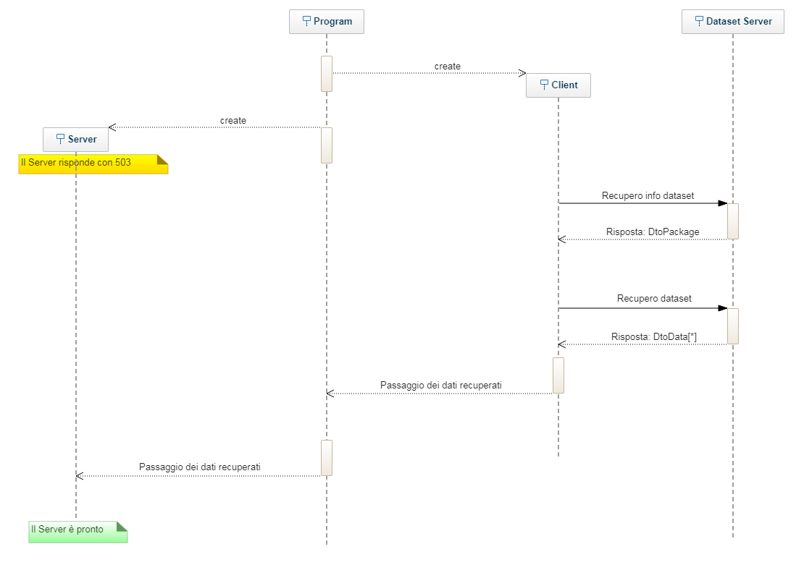

# **Progetto Programmazione ad Oggetti 2019**

## **Domenichelli Daniele - UNIVPM s1067315**

## Progamma

Il programma all'avvio esegue tre operazioni:
1. Recupero delle configurazioni dal file `config.properties` presente nella cartella di esecuzione
2. Creazione del ***Client*** per il recupero del **dataset**
3. Creazione del ***Server*** per l'esposizione delle api

Per lanciare il programma è possibile utilizzare il pacchetto jar `dist/objprog2019.jar`.

Sono stati preparati i file `launch.bat`, `launch.verbose.bat`, `launch.sh` e `launch.verbose.sh` per poter lanciare velocemente il programma.

***Nota:*** per poter lanciare correttamente il programma (con la relativa configurazione) è necessario posizionarsi all'interno della cartella dist.

### Configurazione
Nel `config.properties` sarà possibile definire le seguenti configurazioni:
* `baseUrl`: l'url dal quale reperire le informazioni sul **dataset**
* `verbose`: on/off per la modalità Verbose del programma [ true, fale, 1, 0 ] { *opzionale - default: false* }
* `port`: la porta alla quale il server ascolterà [ intero ] { *opzionale - default: 80* }

## Client
Il ***Client*** articola la raccolta del **dataset** in due chiamate http(s) distinte:
1. Reperimento del link del **dataset** tramite il parsing del json recuperato all'indirizzo fornito dal professore via email
2. Reperimento e parsing del file formato csv

Una volta ottenute le informazioni il ***Client*** le fornisce al ***Program*** che funge da punto di scambio con il ***Server***.

## Server
Il ***Server*** si mette in ascolto alla porta fornita. Finché il ***Client*** non avrà fornito i dati necessari al servizio, qualsiasi chiamata effettuata al ***Server*** avrà come risposta:

> Service Unavailable - 503

Una volta che i dati sono stati recuperti, il server esporrà le seguenti *API*:

* `/` - Pagina di Index con alcuni collegamenti veloci di esempio
* `/package` - json recuperato dal link fornito per reperire le informazioni sul **dataset**
* `/metadata` - json contenente tutti i campi ed i loro relativi tipi contenuti nel **dataset**
* `/data?filter`- json contenete il **dataset** opportunamente filtrato (filter è opzionale)
* `/stats?field&filter` - json contenente delle statistiche sul **dataset** opportunamente filtrato

Le *API* sono interrogabili tramite chiamate http *GET* o *POST*. In entrambi i casi è possibile passare i parametri attraverso query string o all'interno del corpo della richiesta, in formato json. I parametri passati attraverso il corpo hanno precedenza su quelli passati in query string.

### Metadata
La chiamata `/metadata` restituisce un array di oggetti di questo tipo:
```
[
    {
        "alias": alias utilizzabile,
        "sourceField": campo utilizzato nel Dto,
        "type": classe associata al campo
    },
    {
        "alias": "id",
        "sourceField": "ID",
        "type": "long"
    },
    { altro metadato },
    ...
]
```
Grazie a questa chiamata è possibile conoscere quali campi si possono usare come filtro nelle altre chiamate.

### Alias
L'alias è un modo per richiamare i campi degli elementi del **dataset**.

Il parametro `field` della chiamata `/stats?field&filter` corrisponde all'alias del **dataset**.

Gli alias dei parametri vengono sempre valutati in modo *case-insensitive*.


### Filtro
Il parametro `filter` passato alle chiamate `/data?filter` e `/stats?field&filter` può essere composto in questo modo:

*(valore = valore assegnato al json, dato = valore dell'elemento del dataset)*
```
{
    "filter": {
        "alias_del_parametro": {
            "$eq": dato == valore,
            "$not": dato != valore,
            "$lt": dato < valore,
            "$lte": dato <= valore,
            "$gt": dato > valore,
            "$gte": dato >= valore,
            "$in": [ dato contenuto in questo array di valori ],
            "$nin": [ dato non contenuto in questo array di valori ],
            "$bt": [ dato compreso tra valore minimo, valore massimo ] (array di valori con dimensione >= 2)
        },
        "alias_del_parametro": dato == valore,
        "$or": [
            {
                "alias_del_parametro": { ... },
                "alias_del_parametro": dato == valore,
                "$or": ...,
                "$and": ...
            },
            { un altro oggeto filter },
            ...
        ],
        "$and": [
            { un altro oggeto filter },
            { un altro oggeto filter },
            ...
        ]
    }
}
```
Ogni campo del filtro è opzionale, se omesso il **dataset** non verrà filtrato per quel campo.

La valutazione del filtro avviene in questo ordine di precedenza:
1. Condizioni definite dagli ***Alias*** dei parametri
2. Condizioni in logica ***OR*** ($or)
3. Condizioni in logica ***AND*** ($and)

***Nota:*** Qualora il filtro sia mal formattato verrà restituita la risposta:
> Bad Request - 400

***Nota:*** Se presente, il campo del filtro `$bt` deve avere una dimensione maggiore o uguale a 2 altrimenti verrà ignorato. Inoltre se la dimensione è maggiore di 2 verranno tenuti in considerazione solo i primi 2 elementi. Infine se il valore massimo è minore del valore minimo verrà restituito un array vuoto.


### Statistiche
Le statistiche che è possibile recuperare tramite la chiamata `/stats?field&filter` sono nel seguente formato:
```
=== JSON ASSOCIATO A CAMPI NUMERICI ===
{
    "field": alias richiesto,
    "type": classe associata al campo,
    "count": numero di elementi non nulli (dopo il filtro),
    "empty": numero di elementi nulli (dopo il filtro),
    "total": numero di elementi (dopo il filtro),
    "average": media elementi non nulli,
    "min": valori minimo non nullo,
    "max": valore massimo non nullo,
    "std": deviazione standard,
    "sum": somma valori non nulli
}

=== JSON ASSOCIATO A CAMPI NON NUMERICI ===
{
    "field": alias richiesto,
    "type": classe associata al campo,
    "count": numero di elementi non nulli (dopo il filtro),
    "empty": numero di elementi nulli (dopo il filtro),
    "total": numero di elementi (dopo il filtro)
}
```
Il filtro viene chiaramente applicato sul **dataset** prima del calcolo delle statistiche.

***Nota:*** Qualsiasi valore nullo non viene considerato ai fini dei calcoli di `average`, `min`, `max`, `std`, `sum`; se sono presenti solo valori nulli questi campi saranno nulli.

***Nota:*** Qualora l'alias fornito non sia presente nel **dataset** verrà restituita la risposta:
> Field { field } not found! - Bad Request - 400


## UML
Sono riportate in UML le sole classi con almeno due collegamenti ad altre classi e le classi statiche di utilità.

### DtoData


### DtoFilter


### DtoPackage


### Server


### Utilities


### Program Lifetime
